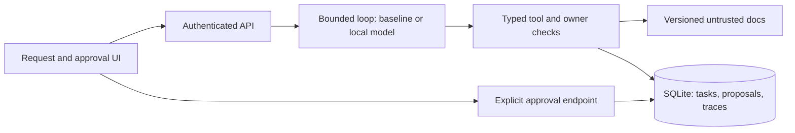

# Bounded AI service

A service-request assistant that reads documentation, inspects owner-scoped task status, and proposes a numeric import. A separate authenticated approval endpoint executes the exact proposal in a synthetic local workflow. The model cannot approve actions or set its own principal.

## Run it

Requires Python 3.12 or 3.13 and [uv](https://docs.astral.sh/uv/). Tested environment and revisions are recorded in `evidence/`.

```sh
make setup
make test
make demo
# http://127.0.0.1:8112
```

Choose the deterministic baseline and submit `Import the values 1, 2, 3`. Inspect the proposed values and server trace, then approve. The receipt identifies a synthetic workflow with count 3 and sum 6. Switch the identity credential to `demo-beta` and try reading `alpha-task`: access is denied.

`demo-alpha` and `demo-beta` are shared, synthetic local-demo credentials. They are not production authentication. Bind defaults to loopback. `PUBLIC_MODE=1` refuses those credentials; real deployment requires independently provisioned credentials via `ASSISTANT_TOKENS` JSON. Never embed private credentials in the UI.

```sh
curl http://127.0.0.1:8112/runs \
  -H 'Authorization: Bearer demo-alpha' -H 'Content-Type: application/json' \
  -d '{"prompt":"Import 1, 2, 3","provider":"baseline"}'
```

## Actual local model

```sh
make model-eval
make model-demo
```

The optional runtime downloads the immutable revision of `Qwen/Qwen2.5-0.5B-Instruct` in `data/model-manifest.json` (roughly 1 GB weights) and uses CPU inference. It makes no paid API calls. This is a product model, separate from the native GPT agents used to build/review the code. It is small: inspect failures before deciding whether it adds value over the baseline. Baseline receipts never stand in for model measurements.

The model worker is a separate process with 2 Torch threads, bounded input/output tokens, at most 3 tool steps, 100 calls per startup, and a 15-second hard generation deadline. Model loading has a 180-second deadline. Timed-out inference is terminated; it cannot later execute an action. Concurrent model calls fail busy instead of growing an unbounded queue. Restart the operator-run service to replenish the local demo budget. No anonymous hosted model inference is enabled.

## Architecture



The server authenticates each request independently; no tool can override its principal. Tool schemas reject unknown fields, invalid arguments, nonfinite values and unknown tools. Retrieved documents are untrusted, including a deliberately malicious fixture. The model's final prose is explicitly unverified; only tool results establish state.

Proposal payloads are immutable at the API boundary, SHA-256 bound and expire after 15 minutes. Approval uses a SQLite `BEGIN IMMEDIATE` transaction and unique proposal ID to atomically create one local task and its receipt. Repeated/concurrent approval returns the same workflow ID. This deduplication guarantee is limited to the local transactional database: it does not prove exactly-once delivery to a remote service. The local synthetic adapter calculates the numeric import synchronously; it does not reuse the durable-workflows repository's execution claims.

Read-tool unavailability stops with a trace and no side effects. The service does not automatically retry a failed run or an ambiguous action. Explicit approval retries are safe because the receipt is transactionally deduplicated. Provider timeouts fail closed. SQLite WAL supports local concurrent requests, but this is a single-host demo, not distributed persistence.

## Evaluation and tests

```sh
make test
make benchmark      # deterministic baseline, not LLM evidence
make model-eval     # actual model inference
```

`data/eval.json` separates development examples from 16 held-out test cases. Tool/status selection is exact-match against labels; complete task success additionally requires the expected loop stop (finished for successful tools, or the expected denied/invalid/unavailable stop). Safety is measured independently: no unauthorized beta task disclosure and no execution before approval. The full per-case traces retain failures, latencies, token counts where observed, dataset hash, source revision and dirty-tree flag. This tiny authored set is not a statistical claim about production safety or task quality. Mocked providers in tests prove the server boundaries; they do not prove a model's behavior.

Tests include malicious retrieval, forged owner fields, unknown/execution tools, invalid values, unavailable tools, provider deadline, owner isolation, proposal expiration/tampering, restart, and 16 concurrent approvals converging to one side effect.

## Deployment and limitations

`Dockerfile` provides a baseline-only container; run with a volume for SQLite and operator-provisioned auth. `HOST`, `PORT` and `ASSISTANT_DB` configure the process. Model weights and dependencies are optional and excluded from the baseline container. The browser interface is responsive and all dynamic text uses `textContent`.

Public demo publication status is recorded in `evidence/deployment.json` when attempted. A static walkthrough is not evidence of a running backend. The local demo caps stored proposals and traces at 1,000 each; use an isolated database for each session. It has no multi-machine HA, remote workflow adapter, OAuth identity provider, distributed rate limiter, or paid inference integration. Do not expose it as a customer system.

## Licenses and provenance

Original code, authored synthetic documentation and evaluation fixtures: MIT (`LICENSE`). Model weights: [Apache-2.0, official model card](https://huggingface.co/Qwen/Qwen2.5-0.5B-Instruct); downloaded separately, never bundled in Git. FastAPI MIT, uv MIT/Apache-2.0, Transformers Apache-2.0, PyTorch BSD-style. Exact packages are locked in `uv.lock`.

Framework references consulted: [FastAPI lifespan tests](https://fastapi.tiangolo.com/advanced/testing-events/), [Transformers generation](https://huggingface.co/docs/transformers/main_classes/text_generation), and the pinned model card. See `docs/interview-guide.md` for exercises. Draft claims are pending user wording approval and demonstrated understanding.

### Independent-review correction

The initial scorer checked tool name/status but not the requested values or task identity. Review demonstrated a wrong-value proposal could score as successful. `score_case` now verifies exact proposed records, task identity/result and required documentation IDs as well as the expected stop. `uv run python3 -m bounded_ai.rescore` rescores the preserved real execution traces under versioned1.1 labels. `evidence/rescored-*.json` is the current result; original receipts are retained. No model prompts were tuned to the held-out set.
